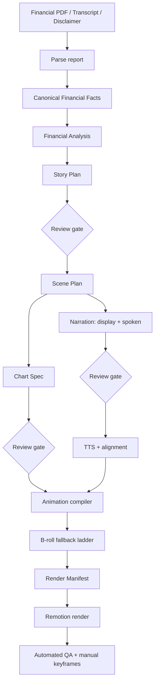

# AI Financial Video Generation Workflow

## Overview

This repository is a local, artifact-first workflow for converting financial reports into narrated videos with animated charts, cartoon-style visual elements, burned-in subtitles, and a closing disclaimer. It supports two explicit runtime modes:

- **Deterministic mode** is a zero-API-key, reproducible demonstration. It uses versioned example facts, fixed planning templates, local macOS speech, built-in visual fallbacks, and the real Remotion renderer.
- **Production mode** parses user-supplied PDF reports and calls OpenAI, ElevenLabs, and BACH. Missing production credentials cause an immediate error; production mode never silently switches to deterministic content.

Both modes preserve intermediate JSON artifacts, structured events, aggregate metrics, the render manifest, audio, the final MP4, and a QA report under a run-specific directory.

## Workflow



## Prerequisites and installation

### Required tools

| Tool | Supported/recommended version | Purpose | Installation location |
|---|---:|---|---|
| Python | 3.11+ recommended | API, PDF parsing, workflow, tests | System/package-manager location; project packages are isolated in `<project-folder>/.venv/` |
| Node.js | 20+ | Remotion, React, TypeScript | System/package-manager location |
| npm | Version bundled with Node.js | Installs JavaScript packages | System/package-manager location; packages go to `<project-folder>/node_modules/` |
| Git | Current stable | Source control | System/package-manager location |
| Chrome Headless Shell | Managed by Remotion | Programmatic rendering | Downloaded automatically by Remotion on the first render |
| `say` and `afconvert` | Built into macOS | Deterministic Chinese TTS and WAV conversion | `/usr/bin/say` and `/usr/bin/afconvert` |

Windows and Linux can run production mode without `say` because production TTS uses ElevenLabs. Deterministic mode currently requires macOS for its local voice track; a cross-platform local TTS adapter is a future extension.

An additional system ffmpeg installation is not required by the current renderer. Remotion installs its compositor and ffmpeg/ffprobe binaries inside `node_modules`.

### Project package versions

Python packages are pinned in `requirements.txt`. The primary packages are:

- FastAPI 0.116.1
- Uvicorn 0.35.0
- Pydantic 2.11.7
- PyMuPDF 1.26.3
- HTTPX 0.28.1
- python-multipart 0.0.20
- python-dotenv 1.2.1
- pytest 8.4.1

JavaScript package ranges are declared in `package.json`; exact installed versions are recorded in `pnpm-lock.yaml`. The delivered workspace resolved:

- Remotion 4.0.490
- React / React DOM 19.2.7
- ECharts 6.1.0
- TypeScript 5.9.3

### Clean installation

From a terminal, replace `<project-folder>` with the folder containing this README:

```bash
cd <project-folder>

python3 -m venv .venv
source .venv/bin/activate
python -m pip install -r requirements.txt

npm install
cp .env.example .env
```

Windows PowerShell activation uses:

```powershell
.venv\Scripts\Activate.ps1
```

All project-specific dependencies remain local:

```text
<project-folder>/.venv/          Python interpreter and Python packages
<project-folder>/node_modules/   Remotion, React, TypeScript, ECharts, compositor
<project-folder>/.env            Local credentials and runtime configuration; never commit
```

### Delivered workspace note

The already-generated demonstration in this workspace used Python 3.9.6 with `eval-type-backport`, Node.js 24.14.0, and pnpm 11.9.0 supplied by the Codex workspace runtime. Those tools were not installed globally on the operating system. For a clean independent setup, use the standard Python 3.11+ and Node.js 20+ installation described above.

## Runtime configuration

Copy `.env.example` to `.env`. The important variables are:

```dotenv
APP_ENV=local
ARTIFACT_ROOT=./runs

# deterministic or production
ADAPTER_MODE=deterministic

OPENAI_API_KEY=
OPENAI_MODEL=gpt-5-mini
OPENAI_BASE_URL=https://api.openai.com/v1

ELEVENLABS_API_KEY=
ELEVENLABS_VOICE_ID=
ELEVENLABS_BASE_URL=https://api.elevenlabs.io/v1

BACH_API_KEY=
BACH_BASE_URL=
BACH_VIDEO_PATH=/v1/generate/video
BACH_IMAGE_PATH=/v1/generate/image

REQUEST_TIMEOUT_SECONDS=120
REMOTION_CONCURRENCY=2
```

`BACH_VIDEO_PATH` and `BACH_IMAGE_PATH` are configurable because BACH deployments may expose different routes. The adapter expects a JSON response and records the provider response in `assets.json`. Confirm the paths and response contract with the target BACH deployment before a production run.

## Deterministic mode

### What it uses

Deterministic mode contains the following versioned inputs and fixed configuration:

| File or symbol | Purpose |
|---|---|
| `examples/nvidia_q1_fy27/input.json` | Demonstration job input, disclaimer, language, style, output settings |
| `examples/nvidia_q1_fy27/canonical_facts.json` | Versioned canonical fact fixture with fiscal periods, calendar dates, units, bases, sources, and confidence |
| `Pipeline._analysis()` | Fixed financial-analysis artifact derived from fixture fact IDs |
| `Pipeline._story()` | Fixed story arc and target duration |
| `Pipeline._scenes()` | Fixed five-scene plan and transition selection |
| `Pipeline._narration()` | Fixed display text, normalized spoken text, and fact references |
| `Pipeline._charts()` | Fixed chart specifications and subtitle reserved region |
| `Pipeline._tts_alignment()` | Deterministic phrase-duration estimator |
| `Pipeline._tts_audio()` | macOS `say` voice `Tingting`, rate 185, converted to PCM WAV |
| `Pipeline._assets()` | Fixed reference registry plus icon/illustration/gradient fallback |
| `TRANSITIONS` | Allowed templates: `cut`, `fade`, `slide`, `wipe`, `zoom` |
| `remotion/` | Real React/Remotion chart, subtitle, animation, and encoding implementation |

No OpenAI, ElevenLabs, or BACH request is made in this mode. The B-roll log explicitly records BACH steps as `skipped_no_key` and uses `icon_illustration_gradient`.

### Run deterministic mode

```bash
cd <project-folder>
source .venv/bin/activate

python scripts/run_workflow.py \
  --mode deterministic \
  --auto-approve \
  --job-id deterministic-demo
```

The legacy convenience command remains available and always forces deterministic mode:

```bash
python scripts/run_demo.py
```

Expected final output:

```text
runs/deterministic-demo/final.mp4
```

## Production mode

### Required initialization

Production mode requires all of the following before it starts billable work:

- `OPENAI_API_KEY`: generates canonical facts and the planning bundle through the Responses API.
- `OPENAI_MODEL`: defaults to `gpt-5-mini`; pin a model/snapshot according to the deployment's quality and reproducibility policy.
- `ELEVENLABS_API_KEY` and `ELEVENLABS_VOICE_ID`: generate multilingual speech and character alignment.
- `BACH_API_KEY`, `BACH_BASE_URL`, `BACH_VIDEO_PATH`, and `BACH_IMAGE_PATH`: generate B-roll video or image assets.
- One or more readable local PDF paths in `source_materials.financial_reports`.
- A non-empty disclaimer in `source_materials.disclaimer`.

Production provider requests may incur cost. The workflow validates all required configuration first, and records API calls, latency, token usage when returned, TTS characters, failures, retries, and artifacts.

### Prepare a production input

Copy the example input and replace the report entry with a real local PDF path. Relative paths are resolved from the current working directory; absolute paths are safer for unattended runs.

The top-level `transcript` object may be omitted to generate narration with the default `zh-CN` settings. Use `mode: "pre-written"` with non-empty `text` to supply the narration. Set `allow_editing` to `false` to preserve that text, or `true` to allow production planning to edit it for clarity, timing, and scene segmentation. `source_materials.earnings_transcript` is reserved for a future earnings-call source input and is currently not consumed; keep it as `null` or omit it.

```json
{
  "source_materials": {
    "financial_reports": ["/path/to/financial-report.pdf"],
    "earnings_transcript": null,
    "supplementary_files": [],
    "disclaimer": "For informational purposes only. This is not investment advice."
  },
  "content_requirements": {
    "topic": "Quarterly earnings overview",
    "objective": "Explain the principal results and outlook",
    "required_metrics": ["revenue", "gross margin", "guidance"],
    "target_duration_seconds": 90
  },
  "transcript": {
    "mode": "generate",
    "text": null,
    "allow_editing": true,
    "language": "zh-CN"
  }
}
```

### Run production mode

```bash
cd <project-folder>
source .venv/bin/activate

# Edit .env first and set ADAPTER_MODE=production plus all provider credentials.
python scripts/run_workflow.py \
  --mode production \
  --input production-input.json \
  --auto-approve \
  --job-id production-run-001
```

The CLI `--mode` value overrides `ADAPTER_MODE`, so the selected mode is explicit in automation. Omitting a required credential produces a configuration error before PDF parsing or API calls.

Production execution is:

1. Parse each local PDF with PyMuPDF and preserve page-level text.
2. Call OpenAI once for canonical facts, financial analysis, story plan, scene plan, narration, and chart spec.
3. Preserve Story Plan, Narration, and Chart Spec review artifacts.
4. Call ElevenLabs for Chinese speech and character timestamps.
5. For every scene, try BACH video; on failure try BACH image plus Remotion camera motion; on another failure use built-in graphics.
6. Compile the animation timeline and render manifest.
7. Render H.264/AAC MP4 with Remotion.
8. Produce automated QA and manual-review keyframes.

## Local web interface

The web service uses `ADAPTER_MODE` from `.env`:

```bash
cd <project-folder>
source .venv/bin/activate
uvicorn app.main:app --reload --port 8000
```

Open `http://127.0.0.1:8000`. Restart the service after changing `.env`. The current UI is intentionally minimal and submits JSON job inputs; the production CLI is the clearest path for supplying local report paths.

## Project structure and organization

```text
<project-folder>/
├── app/
│   ├── __init__.py
│   ├── adapters.py
│   ├── config.py
│   ├── main.py
│   ├── models.py
│   ├── observability.py
│   └── pipeline.py
├── examples/
│   └── nvidia_q1_fy27/
│       ├── canonical_facts.json
│       └── input.json
├── public/
│   └── .gitkeep
├── remotion/
│   ├── index.ts
│   ├── root.tsx
│   └── video.tsx
├── schemas/
│   └── job-input.schema.json
├── scripts/
│   ├── run_demo.py
│   └── run_workflow.py
├── tests/
│   └── test_workflow.py
├── web/
│   └── index.html
├── runs/                         Generated at runtime; not committed
│   └── <job-id>/
├── .env.example
├── .gitignore
├── package.json
├── pnpm-lock.yaml
├── pyproject.toml
├── requirements.txt
├── tsconfig.json
└── README.md
```

The repository is organized by responsibility:

- `app/` contains the Python application and orchestration layer. `models.py` defines public workflow types, `config.py` resolves runtime mode and credentials, `adapters.py` isolates external provider calls, `pipeline.py` coordinates nodes and artifacts, `observability.py` records events and metrics, and `main.py` exposes the local HTTP API.
- `remotion/` contains the deterministic rendering boundary. It accepts only the compiled render manifest and implements the finite chart, subtitle, media, and motion templates available to the workflow. Provider-specific logic must not be added to this directory.
- `schemas/` contains versioned external input contracts. Schema changes should remain backward-compatible or introduce an explicit schema version.
- `examples/` contains deterministic, version-controlled demonstration inputs. Company-specific facts belong here rather than in generic application code or project-level documentation.
- `scripts/` contains operator entry points. `run_workflow.py` is the primary mode-aware CLI, while `run_demo.py` is a deterministic convenience wrapper.
- `web/` contains the minimal local operator interface. It communicates with `app/main.py` and does not implement workflow rules itself.
- `tests/` mirrors high-risk workflow behavior, including canonical fact metadata, text normalization, idempotency, conflict detection, and strict mode validation.
- `public/` is a temporary Remotion staging directory for runtime audio and generated media. Durable artifacts are copied into the corresponding run directory; generated media in `public/` is ignored by Git.
- `runs/<job-id>/` is the immutable-style execution workspace for one job. It contains node outputs, review decisions, logs, metrics, audio, the render manifest, QA results, retries, and the final video.
- Root-level dependency files separate the two runtimes: `requirements.txt` and `pyproject.toml` configure Python, while `package.json`, `pnpm-lock.yaml`, and `tsconfig.json` configure the React/Remotion renderer.

The dependency direction is intentionally one-way: operator entry points call the application layer; the pipeline calls provider adapters and writes artifacts; the renderer consumes the render manifest. External providers and the renderer never write canonical facts or alter approved planning artifacts directly.

## Artifact storage

`ARTIFACT_ROOT` defaults to `<project-folder>/runs`. Every job creates:

```text
<project-folder>/runs/<job-id>/
```

Intermediate and final artifacts are stored as follows:

| Artifact | Default path |
|---|---|
| Normalized job input | `runs/<job-id>/input.json` |
| Parsed PDF text, production only | `runs/<job-id>/parsed_reports.json` |
| Provider planning metadata, production only | `runs/<job-id>/planning_provider.json` |
| Canonical facts | `runs/<job-id>/canonical_facts.json` |
| Financial analysis | `runs/<job-id>/financial_analysis.json` |
| Story plan | `runs/<job-id>/story_plan.json` |
| Story review decision | `runs/<job-id>/review_story_plan.json` |
| Scene plan | `runs/<job-id>/scene_plan.json` |
| Narration display/spoken text | `runs/<job-id>/narration.json` |
| Narration review decision | `runs/<job-id>/review_narration.json` |
| Chart specification | `runs/<job-id>/chart_spec.json` |
| Chart review decision | `runs/<job-id>/review_chart_spec.json` |
| TTS alignment | `runs/<job-id>/alignment.json` |
| TTS metadata | `runs/<job-id>/tts.json` |
| Audio | `runs/<job-id>/narration.wav` in deterministic mode; `narration.mp3` in production |
| Animation timeline | `runs/<job-id>/animation_timeline.json` |
| Reference registry and B-roll attempts | `runs/<job-id>/assets.json` |
| Renderer contract | `runs/<job-id>/render_manifest.json` |
| Node and workflow events | `runs/<job-id>/events.jsonl` |
| Aggregate metrics and costs | `runs/<job-id>/metrics.json` |
| Current asynchronous state | `runs/<job-id>/job.json` |
| Automated QA report | `runs/<job-id>/qa_report.json` |
| Final video | `runs/<job-id>/final.mp4` |
| Scene retry requests | `runs/<job-id>/retry_<scene-id>_<number>.json` |

Runtime audio is temporarily copied to `<project-folder>/public/` so Remotion can bundle it. Generated audio in that directory is ignored by Git. The durable copy remains inside the run directory.

## Modes and fallback behavior

| Behavior | Deterministic | Production |
|---|---|---|
| API keys | Not used | Required and validated |
| Report source | Versioned fixture | User-supplied local PDFs |
| Planning | Fixed Python templates | OpenAI Responses API |
| TTS | macOS `say` | ElevenLabs with timestamps |
| B-roll | Built-in graphics | BACH video → BACH image/camera motion → built-in graphics |
| Renderer | Remotion | Remotion |
| Artifact and QA model | Full | Full |
| External cost | None | Provider-dependent |

Mode selection is strict. Production failures do not reuse deterministic facts, narration, or story templates. Only the documented per-scene visual fallback remains active in production.

## API and asynchronous state

- `POST /api/jobs`: create a job; supports `Idempotency-Key`.
- `GET /api/jobs/{id}`: inspect job and node state.
- `GET /api/jobs/{id}/artifacts/{name}`: download an artifact.
- `POST /api/jobs/{id}/reviews/{node}/approve|reject`: persist a review decision.
- `POST /api/jobs/{id}/scenes/{scene_id}/retry`: invalidate only scene-level downstream work.
- `GET /api/jobs/{id}/events`: read newline-delimited structured events.

States are `queued`, `running`, `waiting_review`, `rendering`, `qa`, `completed`, `failed`, `cancelled`, and `blocked_conflict`.

## Canonical facts and safety rules

Canonical facts retain `metric`, base-unit `value`, `unit`, `scale`, `currency`, accounting `basis`, `fiscal_period`, calendar `period_end`, comparison, page-level source locator, and confidence. Derived facts must identify input fact IDs and formulas. Numeric narration and chart claims must cite canonical fact IDs.

Narration stores `display_text` separately from `spoken_text`. Subtitle layout reserves the lower safe region and limits burned-in subtitles to two lines. Transition selection is limited to implemented templates: `cut`, `fade`, `slide`, `wipe`, and `zoom`.

## Tests and verification

```bash
source .venv/bin/activate
pytest -q
npx tsc --noEmit
```

Automated QA checks fact references, transition templates, timeline bounds, subtitle safe regions, disclaimer presence/duration, and video existence. A production approval process should additionally inspect the keyframes listed in `qa_report.json` and independently verify financial facts.

## Evaluation Metrics

### Content
- financial fact accuracy
- required metric coverage
- unsupported claim rate

### Audio
- TTS success
- timestamp completeness
- pronunciation issues

### Visual
- chart correctness
- label overflow
- missing assets
- scene visual relevance

### Synchronization
- difference between animation & phrase timing
- subtitle timing
- audio/video duration mismatch

### System
- generation success rate
- total latency
- cost per video
- retries
- manual intervention rate


## Architecture and future work

- FastAPI, Pydantic, and Python implement the workflow API, validation, state, and provider adapters.
- PyMuPDF extracts PDF text with page provenance.
- OpenAI produces schema-guided planning artifacts constrained to canonical fact IDs.
- ElevenLabs produces multilingual narration and alignment.
- BACH produces reusable visual references and scene assets through configurable routes.
- React, Remotion, ECharts, and SVG provide deterministic rendering.

Recommended next steps include SEC/XBRL cross-validation, a resumable queue such as Temporal, a real review/resume UI, BACH deployment-specific polling/download contracts, renderer support for arbitrary production chart types, Postgres/Redis state, object storage, OpenTelemetry, and automated visual-regression evaluation.

## Disclaimer

This repository and its generated demonstration are for product and technical evaluation. Generated financial content must be reviewed by qualified financial, legal, compliance, and brand stakeholders before publication.
